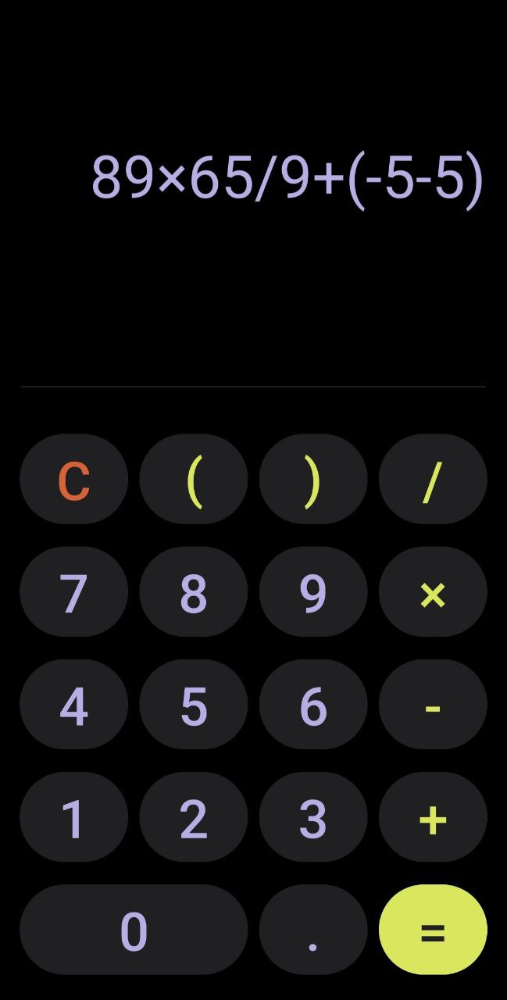

# AndroidCalculator

Простой калькулятор для выполнения базовых арифметических операций. Проект создан в учебных целях с использованием архитектурного паттерна MVP.

## Особенности

- Поддержка операций сложения, вычитания, умножения и деления.
- Поддержка скобок в выражениях.
- Поддержка унарного минуса (допустим в начале выражения и после "(" ).
- Удобный интерфейс с кнопками для ввода чисел и операций.
- Обработка ошибок ввода (например, попытка деления на ноль или попытка вычислить некорректное выражение ("2+=") ).
- Проверка корректности ввода (например, нельзя ввести несколько операций подряд, нельзя ввести ")" больше чем "(" ).
- Анимация кнопок для улучшения пользовательского опыта.

## Функциональность

- Поддержка ввода десятичных чисел.
- Результат вычисляется при нажатии кнопки "=".
- Кнопка "C" удаляет последний введённый символ.
- Долгое нажатие на кнопку "C" очищает всё введённое выражение.

## Ограничения

- Максимальное количество цифр после запятой: 10.
- Максимальное количество цифр в одном числе: 15.
- Точность результата ограничена 10 знаками после запятой.

## Как запустить проект

### Вариант 1: Через Android Studio

1. Клонируйте репозиторий: git clone https://github.com/Ally-al/AndroidCalculator.git
2. Откройте проект в Android Studio.
3. Подключите устройство или запустите эмулятор.
4. Нажмите "Run" для запуска приложения.

### Вариант 2: Установка APK

1. Перейдите в папку release в репозитории.
2. Скачайте файл `calculator.apk`.
3. Установите APK на свое устройство (включите установку из неизвестных источников, если необходимо).

## Технологии

- **Язык**: Kotlin
- **Архитектурный паттерн**: MVP (Model-View-Presenter)
- **Инструменты**: Android Studio, Gradle

## Скриншоты

## Планы на будущее

- Исправить возможность ввода чисел с незначащими нулями в начале, таких как "00.0", "00005" и т.д. (числа не должны начинаться с нулей, за исключением случая с "0" или "0.").
- Добавить возможность работы с числами в экспоненциальной записи (сейчас после вычислений может получиться, например "9999*9999=9.9980001E7", 
  и с получившимся выражением дальше уже нельзя работать, возникает ошибка некорректного формата).
- Предотвратить перенос и разделение одного числа на две строки в поле ввода.
- Добавить светлую тему.
